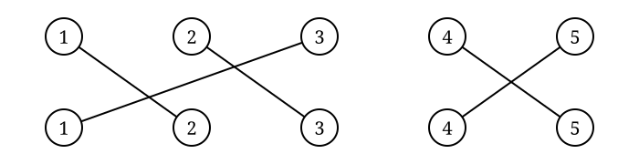

## Class Session Goals

- Define the symmetric group $S_n$.
- Represent permutations using cycle notation.
- Compute products of permutations.
- Write permutations as products of disjoint cycles and transpositions.

---

## What is the Symmetric Group?

A **permutation** of a set $X$ is a one-to-one and onto function

$$
\sigma:X\longrightarrow X.
$$

The permutations of a set $X$ form a group $S_X$.

If $X$ is finite, we can assume

$$
X=\{1,2,\ldots,n\}.
$$

In this case, we write $S_n$ instead of $S_X$.

The group $S_n$ is called the **symmetric group on $n$ letters**.

---

## Permutation Drawings

A permutation describes a rearrangement of a set.

We can represent a permutation by drawing where each element is sent.

{width=48% fig-align="center"}

Follow the lines in the drawing:

$$
1\mapsto2,\qquad
2\mapsto3,\qquad
3\mapsto1,\qquad
4\mapsto5,\qquad
5\mapsto4.
$$

Every element is sent to exactly one element, and every element is the image of exactly one element.

---

## From Drawings to Permutation Notation

We can record the same permutation without the drawing.

The **top row** lists the elements.

The **bottom row** records where each element is sent.

$$
\begin{pmatrix}
1&2&3&4&5\\
2&3&1&5&4
\end{pmatrix}
$$

The drawing and the two-line notation represent the same permutation.

---

## Activity: Build $S_4$

Today we are going to construct **every element of $S_4$**.

There are $|S_4|=4!=24 permutations to construct.

For each card:

1. Draw the permutation by connecting the top row to the bottom row.
2. On the top half of the blank side, write the permutation in two-line notation.
3. Leave the bottom half blank — we will add different notation later.

---

## We Have a Set — Now We Need an Operation

We have constructed the $24$ elements of $S_4$. How should we **multiply** two permutations?

Place one permutation drawing **on top of another** and follow the paths from top to bottom.

If $\sigma$ is on the bottom and $\tau$ is on the top, we write $\sigma\tau$.

Apply the function $\tau$ first, then $\sigma$. 

$$\sigma\tau(x)=\sigma(\tau(x))$$

---

## Activity: Explore Multiplication in $S_4$

Choose several pairs of tiles and calculate their products.

For each pair, stack the two permutation drawings. Follow $1,2,3,4$ through both drawings. Find the tile representing the product.

Ponderings: Does your product always correspond to another tile in $S_4$? Can you find an indentity tile $e$? Can you find inverses?

---

## Activity: What About Associativity?

Choose three permutation tiles and call them $\sigma,\qquad\tau,\qquad\rho$.

Calculate $(\sigma\tau)\rho$. Find the corresponding tile in $S_4$ for $(\sigma\tau)$.

Calculate $\sigma(\tau\rho)$. Find the corresponding tile in $S_4$ for $(\tau\rho)$.

Compare your results are the two resulting mappings the same or different?

--

## Theorem 5.1.1

The symmetric group on $n$ letters, $S_n$, is a group with $n!$ elements, where the binary operation is the composition of maps.

---

## Proof

**Identity:** Consider the permutation $\pi(i)=i$.

**Inverse:** If $\pi(i)=j$, define $\tau(j)=i$.

**Associativity:** Composition of maps is associative.

The order of $S_n$ is an exercise.

---

## Activity: What about Communitivity?

Choose two permutation tiles and call them $\sigma$ and $\tau$.

Calculate  both $\sigma\tau$ and $\tau\sigma$.

Find pairs of tiles that do commute and pairs of tiles that don't communte.

---

## Cycle Notation

Permutation drawings show us where every element goes. Instead of recording every mapping, we can follow an element until we return to where we started.

{width=60% fig-align="center"}

For example, $1\mapsto2\mapsto3\mapsto1$ is written $(1\,2\,3)$.

The other set of elements satisfies $4\mapsto5\mapsto4$. We write $(4\,5)$.

Together, the permutation is $(1\,2\,3)(4\,5)$. This is called **cycle notation**.

---

## Reading Cycle Notation

In the cycle $(1\,3\,4\,2)$ we read from left to right:

$$
1\mapsto3,\qquad
3\mapsto4,\qquad
4\mapsto2,\qquad
2\mapsto1.
$$

Elements that do not appear in a cycle are fixed.

For example, in $S_6$ $(1\,3\,4\,2)$

also means $5\mapsto5 \qquad\text{and}\qquad6\mapsto6$.

---

## Activity: Add Cycle Notation to $S_4$

Return to your $S_4$ permutation tiles.

For each tile, write the result in cycle notation in the remaining blank space.

Ponderings: Which permutations consist of one cycle? Which have more than one cycle? Which elements are fixed?

---

## Activity: Cycle Notation in $S_6$

Now return to the $S_6$ tiles you constructed.

For each tile write the permutation in cycle notation.

Then compare your tiles with others in your group.

Ponderings: Can you find a permutation with fixed points, a $2$-cycle, a $3$-cycle, a $4$-cycle, a $5$-cycle, a $6$-cycle, and a permutation containing two disjoint cycles?

---

---

## Cycle Notation Multiplication

Let

$$
\sigma=(1\,3\,5)(2\,4),
\qquad
\tau=(1\,2\,6)(3\,4).
$$

Compute $\sigma\tau$ **right to left**:

$$
1\xrightarrow{\tau}2\xrightarrow{\sigma}4
\quad
4\xrightarrow{\tau}3\xrightarrow{\sigma}5
\quad
5\xrightarrow{\tau}5\xrightarrow{\sigma}1
$$

so we get $(1\,4\,5)$.

Starting with $2$:

$$
2\xrightarrow{\tau}6\xrightarrow{\sigma}6
\quad
6\xrightarrow{\tau}1\xrightarrow{\sigma}3
\quad
3\xrightarrow{\tau}4\xrightarrow{\sigma}2
$$

so we get $(2\,6\,3)$.

Therefore,

$$
\boxed{\sigma\tau=(1\,4\,5)(2\,6\,3)}.
$$

---

## Proposition 5.1.8

Let $\sigma$ and $\tau$ be two disjoint cycles in $S_X$. Then $\sigma\tau=\tau\sigma$.

If $x$ occurs in $\sigma$, then $\tau$ fixes $x$ and every element to which $\sigma$ sends $x$.

---

## Theorem 5.1.9

Every permutation in $S_n$ can be written as the product of disjoint cycles.

---

## Proof

Start with $1$ and repeatedly apply $\sigma$:

$$
1,\sigma(1),\sigma^2(1),\ldots
$$

Since the set is finite, we eventually return to $1$, producing a cycle.

Next, choose an element not appearing in that cycle and repeat the process.

Continuing in this manner produces disjoint cycles $\sigma_1,\sigma_2,\ldots,\sigma_r$

such that$\sigma=\sigma_1\sigma_2\cdots\sigma_r$.

---

## Transpositions

A cycle of length $2$ is called a **transposition**.

For example,$(2\,5)$ is a transposition. Any cycle can be written as a product of transpositions:

$$
(a_1\,a_2\,\ldots\,a_n)
=
(a_1\,a_n)(a_1\,a_{n-1})\cdots(a_1\,a_3)(a_1\,a_2).
$$

A permutation is **even** if it can be expressed as an even number of transpositions.

A permutation is **odd** if it can be expressed as an odd number of transpositions.

---

## Activity: Even and Odd Permutations in $S_4$

Return to the **24 permutation tiles** that make up $S_4$.

Then sort all $24$ tiles into two groups: odd permutation and even permutations.

Ponderings: How many permutations are even? How many permutations are odd? What types of cycles appear in each group? 

---

## Theorem 5.1.15

**Theorem.** If a permutation $\sigma$ can be expressed as the product of an even number of transpositions, then any other product of transpositions equaling $\sigma$ must also contain an even number of transpositions.

Similarly, if $\sigma$ can be expressed as the product of an odd number of transpositions, then any other product of transpositions equaling $\sigma$ must also contain an odd number of transpositions.

Thus, although a permutation may have many different representations as products of transpositions, its **parity is well-defined**.

---

## Alternating Group

The set of all even permutations in $S_n$ is denoted by $A_n$.

The group $A_n$ is called the **alternating group on $n$ letters**.

$$
A_n=\{\sigma\in S_n:\sigma\text{ is even}\}.
$$

## Theorem 5.1.16

The set $A_n$ is a subgroup of $S_n$.

Why?

- The product of two even permutations is even.
- The identity is even.
- The inverse of an even permutation is even.

---

## Proposition 5.1.17

**Proposition.** The number of even permutations in $S_n$, $n\geq2$, is equal to the number of odd permutations; hence,

$$
|A_n|=\frac{n!}{2}.
$$

Let $A_n$ be the set of even permutations and $B_n$ the set of odd permutations.

Fix a transposition $\sigma\in S_n$ and define

$$
\lambda_\sigma:A_n\longrightarrow B_n
$$

by $\lambda_\sigma(\tau)=\sigma\tau$. Multiplication by a transposition changes the parity of a permutation. The map $\lambda_\sigma$ is a bijection, so $A_n$ and $B_n$ contain the same number of elements.

---

## Alternating Group Example

$$
|A_4|=\frac{4!}{2}=12,
$$

there are twelve elements:

$$
\begin{aligned}
&(1), &(1\,2)(3\,4), &(1\,3)(2\,4), &(1\,4)(2\,3),\\
&(1\,2\,3), &(1\,3\,2), &(1\,2\,4), &(1\,4\,2),\\
&(1\,3\,4), &(1\,4\,3), &(2\,3\,4), &(2\,4\,3).
\end{aligned}
$$

---